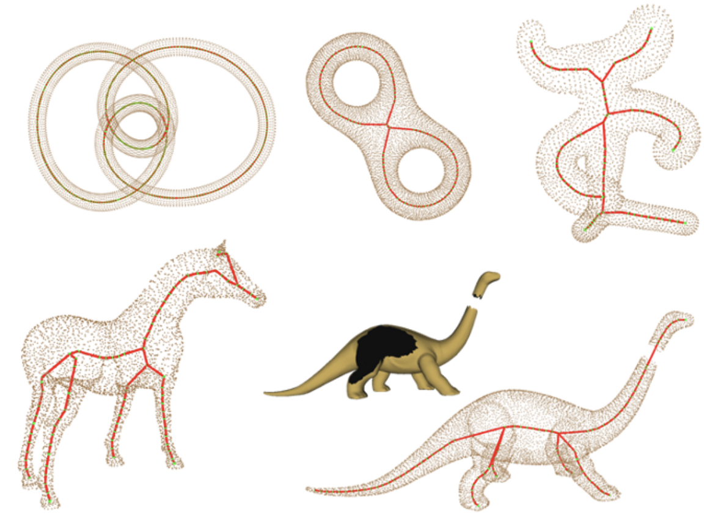

# Solving the Set Cover Problem for 3D Shape Skeletonization


---

## 🚀 Overview

This repository implements a principled, end-to-end pipeline that casts 3D curve–skeleton extraction as a discrete **Set Cover Problem**. Starting from a raw surface point cloud, we:

1. **Generate** a compact pool of interior ball-centers via adaptive Voronoi sampling.  
2. **Dilate** each center until its ball first touches the surface.  
3. **Search** for the _smallest_ subset of balls whose union covers all surface samples, via two complementary exact optimizers:  
   - **MILP formulation** solved with a Mixed-Integer Linear Program.  
   - **SAT formulation** solved with PySAT.

Our experiments on **ScanNet**, **ShapeNet**, and **Pheno4D** demonstrate that the selected skeleton points are robust to noise and capture thin geometric features faithfully.

---

## 📂 Repository Structure

```text
AI-517-Final/
├── input/                       ← raw datasets (not versioned)
├── output/                      ← intermediate meshes & point-clouds
│   ├── ScanNet/
│   ├── ScanNet_SAT/
│   ├── ShapeNet/
│   ├── ShapeNet_SAT/
│   ├── Pheno4D/
│   └── Pheno4D_SAT/
├── final-figures/               ← high-resolution visualizations
├── coverage_axis_pc.py          ← MILP encoding & solver invocation
├── coverage_axis_pc_sat.py      ← SAT encoding & solver invocation
├── vis2.py                      ← initial point-cloud visualizer
├── vis3.py                      ← advanced visualizer (front-view for Pheno4D)
├── requirements.txt             ← Python dependencies
└── README.md                    ← this file
```

⚙️ Installation

Clone the repository and install all dependencies in one step:

```bash
git clone https://github.com/your-username/AI-517-Final.git
cd AI-517-Final
python3 -m venv venv            # Create a virtual env (optional but recommended)
source venv/bin/activate        # Activate it (Linux/macOS)
# On Windows: .\venv\Scripts\activate
pip install --upgrade pip
pip install -r requirements.txt # Install all required packages
```


If you experience errors like `ModuleNotFoundError`, ensure your virtual environment is active and run:
```bash
pip install open3d trimesh pillow pulp pysat 
```

## 📝 Usage


### 1. Preprocess & Sample

Populate your raw `.obj` meshes under `input/`. Then run your favorite sampling tool (e.g., Poisson or Voronoi) to produce:

- `*_processed*.obj` (input to MILP)  
- `*_candidate_inner_points*.obj` (input to SAT)

Place these under the corresponding subfolders in `output/`.

### 2. Solve MILP

```bash
python coverage_axis_pc.py \
  --input-folder output/ScanNet \
  --output-skeleton skel_milp.txt
```
This will read all *_processed*.obj meshes, build the MILP, and write a list of selected ball-centers to skel_milp.txt.

### 3. Solve SAT

```bash
python coverage_axis_pc_sat.py \
  --input-folder output/ScanNet_SAT \
  --output-skeleton skel_sat.txt
```

This will read all *_candidate_inner_points*.obj meshes, encode the set cover as a CNF, and emit the chosen centers to skel_sat.txt.

### 4. Visualize

Generate tight, auto-cropped side-by-side visualizations:

```bash
python vis3.py
```


